

# Práctica 4: Networking with Sockets

#### Para la realización de la práctica voy a desarrollar un resumen o apuntes basados en lo aprendido y en lo considerado más importante. 

En esta práctica vamos a ver los sockets TCP que son el esqueleto de las aplicaciones en red. 
Los servicios en red sirven para conectar extremos y transmitir entre ellos, es decir, el primer paso es establecer la conexión independientemente de la información que se transmita. Un extremo se enlaza a un puerto numerado y el otro extremo se conecta a un puerto para seguir el esquema cliente/servidor.
Para crear servicios basados en sockets vamos a utilizar node.js. 

Para las operaciones de enlace y conexión en node.js se utiliza el módulo net.
En este ejemplo se utiliza el método net.createServer que toma una callback y devuelve un objeto servidor. Se invocará la callback cuando se conecte un extremo. El objeto Socket es el parámetro de coneción y se utiliza para enviar o recibir datos. Tras esto nos unimos al puerto especificado mediante server.listen.

Para entender un poco mejor este proceso se proporciona el siguiente esquema: 

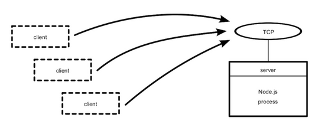

Aquí vemos como el servidor se une a un puerto TCP. Cualquier número de clientes pueden conectarse al puerto vinculado.
Pero todavía nuestro programa no hace nada con la coneción. Para ello, vamos e enviar información al cliente. En el siguiente fichero se muestra cómo se lleva a cabo esta tarea. Se ve como se utilizan los módulos fs y net. Si el usuario no proporciona un archivo del que escuchar se lanza un error, si lo proporciona este es el tercer argumento de process.argv recogido en la constante filename. A continuación, se observa como funciona la función callback. Para empezar nos informa de que la conexión entre cliente-servidor se ha establecido. Después escucha los cambios realizados en el archivo filename proporcionado, enviándose información de cambio al cliente usando connection.write. Para finalizar escucha al evento de cierre de la conexión. 

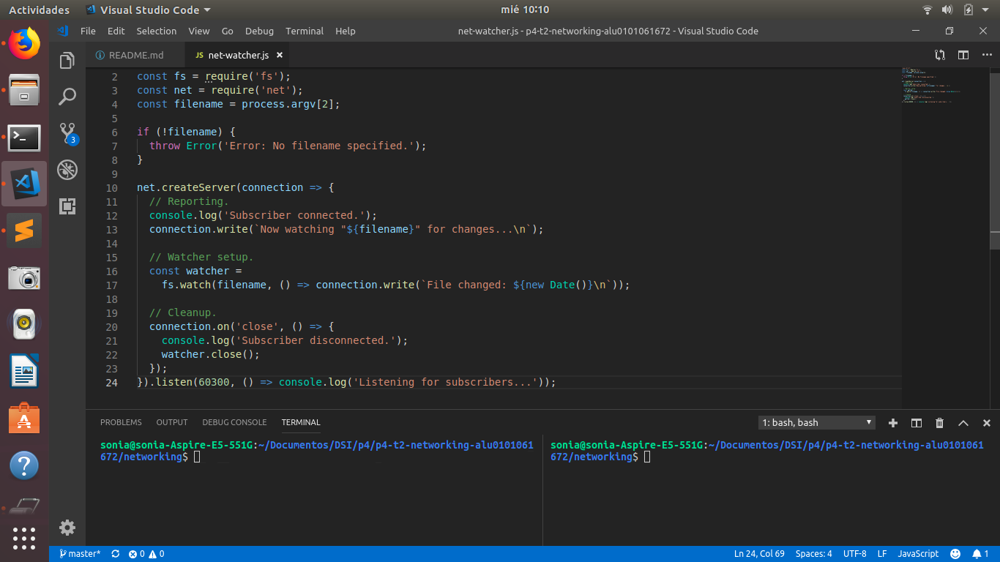

El programa net-watcher se prueba de la siguiente manera:

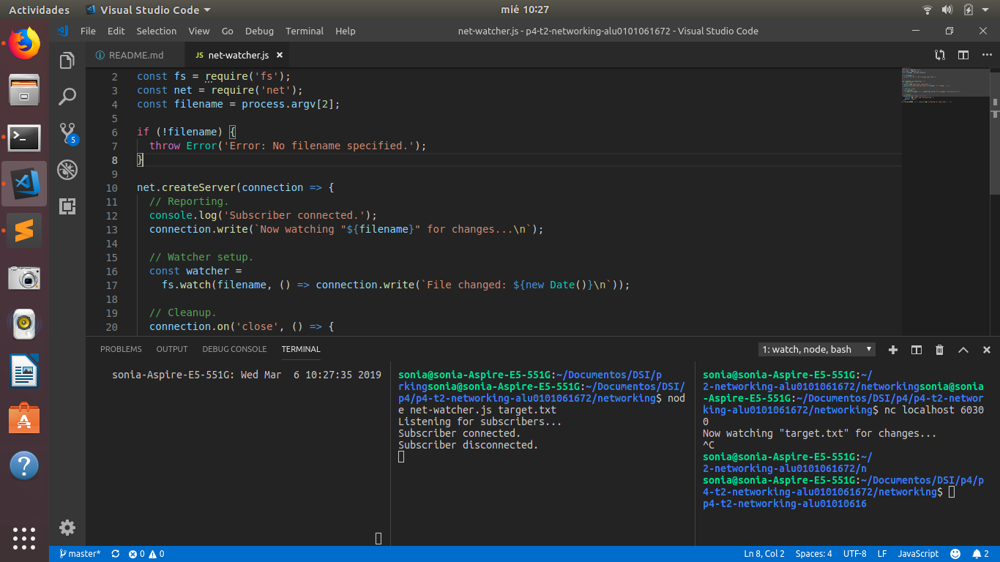

En la primera terminal de la izquierda se ejecuta el servicio, en la del medio el cliente y en la de la derecha se activarán los cambios en el archivo del que se escucha.
Esta configuración creada se describe en la siguiente imagen, en la que el proceso net-watcher vincula un puerto TCP y escucha a un archivo.

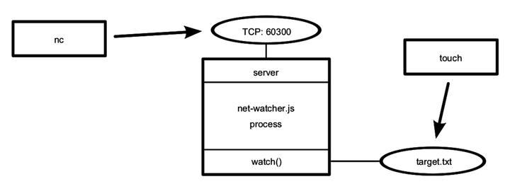

Se pueden conectar múltiples usuarios y recibir actualizaciones simultáneamente. 
Los sockets TCP soon útiles para la comunicación entre equipos conectados en red.

Vamos a ver ahora cómo se escucha en los sockets de Unix. En este caso, para conectar un cliente se especifica la opción -U para usar el fichero socket.

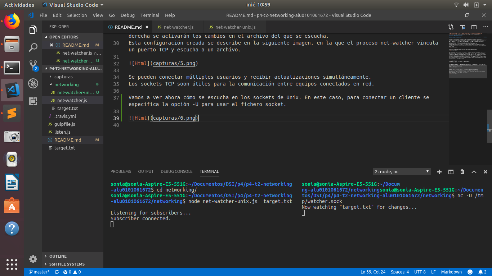

Ahora diseñaremos e implementaremos un protocolo para definir cómo se comunican los extremos en un sistema. Dicho protocolo se basará en pasar mensajes JSON a través de TCP. Así, implementaremos  los extremos del cliente y del servidor que usen este protocolo basado en JSON.
El servicio net-watcher envía dos tipos de mensajes que necesitamos convertir a JSON: 
-Al establecer la conexión por primera vez, el cliente recibe la cadena.
-Cuando el archivo de destino cambia, el cliente recibe una cadena.
Se codificará el primer tipo de mensaje de la siguiente manera:
{​"type"​:​"watching"​,​"file"​:​"target.txt"​}
El campo tipo indica que se trata de un mensaje de observación, el campo file tiene el archivo que está siendo escuchado ahora.

Se codificará el segundo tipo de mensaje de la siguiente manera:{​"type"​:​"changed"​,​"timestamp"​:1358175733785}
El campo tipo anuncia que el archivo de destino ha cambiado, el campo timestamp contiene el valor entero que representa el número de milisegundos desde el 1 de enero de 1970.
Vamos a modificar el servicio net-watcher y crear programas clientes que recibirán e interpretarán estos mensajes.
Para codificar objetos de mensaje usamos JSON.stringify, ya que toma un objeto de JavaScript y devuelve una cadena que contiene una representación serializada de ese objeto en forma JSON.
Al modificar las líneas para usar JSON.stringfy y ejecutarlo nos da la siguiente salida:

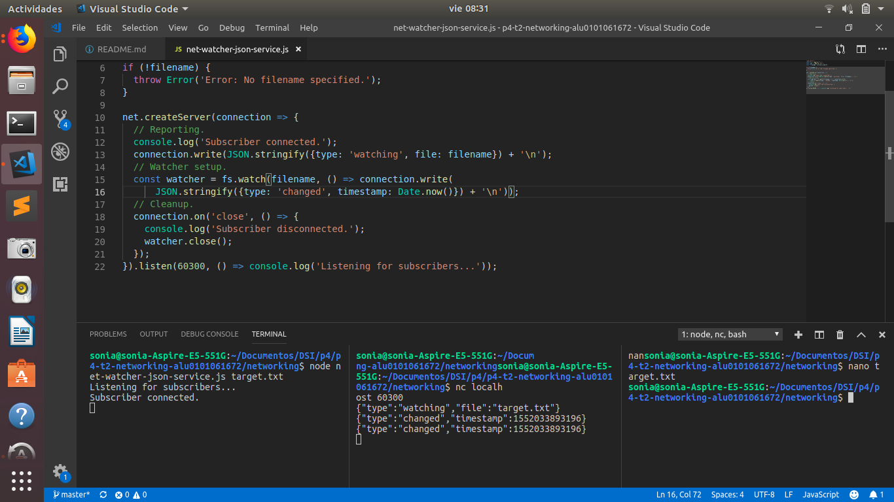

Vamos a escribir un programa cliente para recibir mensajes JSON de nuestro programa net-watcher-json-service.
Se utiliza el net.connect para crear una conexión de cliente al puerto 60300 de localhost y espera por los datos. Cada vez que ocurre un evento de datos, la callback toma el objeto, analiza el mensaje JSON y registra el mensaje.

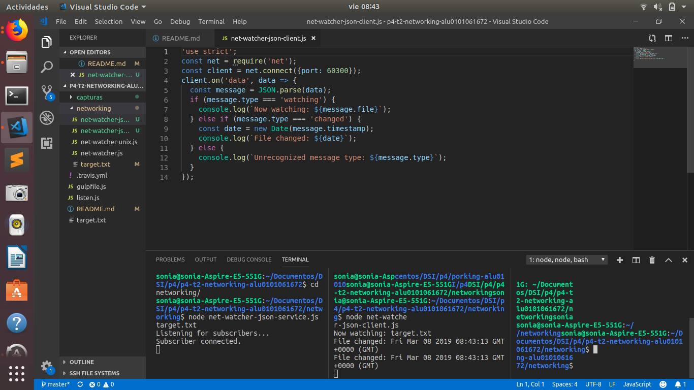

Hay que considerar que sucede cuando finaliza la conexión o si no se puede conectar. Este programa no tiene en cuenta eventos de error. Además, hay que abarcar el problema de los límites de los mensajes.
Desarrollaremos una prueba para nuestros programas de cliente y servidor. Crearemos un servidor simulado mientras exponemos los fallos en el cliente.
Actualmente en nuestro programa los límites del evento de datos coinciden exactamente con los límites del mensaje.
Nuestro programa de cliente analiza cada mensaje enviando el contenido de datos directamente a JSON.parse en las sentencias:
    
    client.on('data', data => {
     const message = JSON.parse(data);
    }

Pero hay que considerar que un mensaje pueda llegar dividido en dos eventos de datos separados como se muestra en la siguiente imagen:

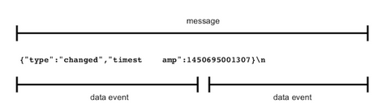

Vamos a crear un servicio de prueba que envíe un mensaje dividido para saber como responde el cliente. Para ello implementaremos un servicio de prueba que divide un mensaje a propósito en múltiples partes.

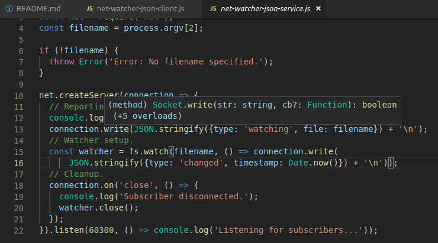

En este fichero enviamos el primer fragmento de inmediato y configuramos un temporizador para enviar el segundo fragmento con un breve retraso. La función setTimeout toma dos parámetros, una función a invocar y una cantidad de tiempo en milisegundos. Esto significa que después de una cantidad de tiempo especificada se llamará a la función. Cuando la conexión finaliza se usa clearTimeout para cancelar la programación de la callback.

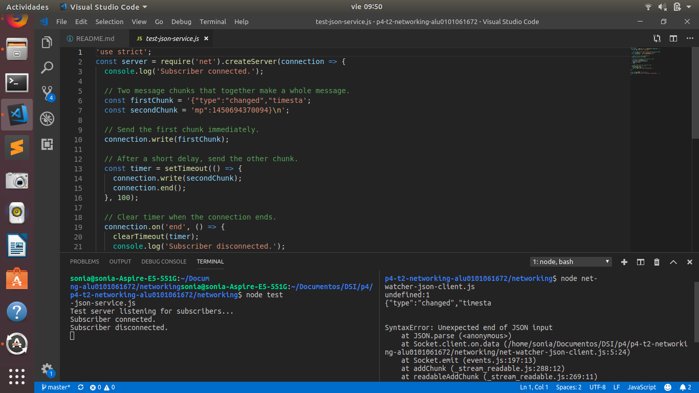

El error producido se debe a que el mensaje JSON no fue válido por no ser completo. Se ha intentado enviar la mitad de un mensaje a JSON.parse, pero solo espera cadenas JSON completas y con el formato correcto como entrada.

Tenemos que hacer que el cliente almacene los datos entrantes en los mensajes y que maneje cada mensaje cuando llegue.
Vamos a crear un módulo para manejar el buffer de entrada para recibir mensajes completos de manera confiable. 
Ahora configuraremos LDJClient para heredar de EventEmitter:

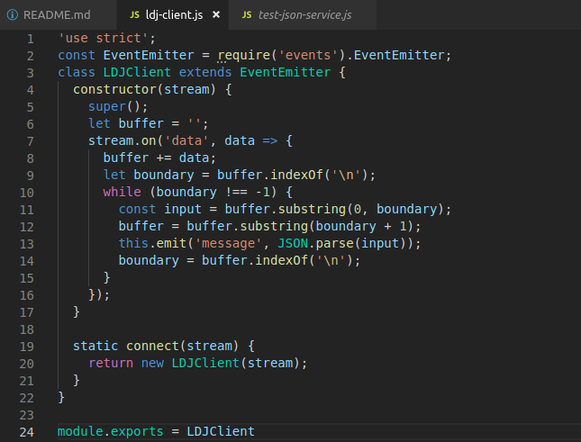

LSJClient es una clase que tiene un constructor. Llama a super para invocar la función constructora de EventEmitter. 

​ 	​const​ client = ​new​ LDJClient(networkStream);
​ 	client.on(​'message'​, message => {
​ 	  ​// Take action for this message.​
​ 	});

Ahora vamos a emitir eventos de mensaje ya que la jerarquía de clases está correctamente. Además, vamos a utilizar el parámetro stream en el LDJClient para recuperar y almacenar la entrada. El objetivo es tomar los datos entrantes y convertirlos en eventos de mensaje que contengan los objetos de mensaje analizados.

En este ejemplo comenzamos llamando a super y configuramos una variable de tipo cadena (string) llamada buffer para capturar los datos entrantes. Para manejar los eventos de datos usamos stream.on. A continuación viene el contrlador de eventos, donde agregamos datos sin procesar al final del buffer y buscamos los mensajes completos desde el inicio. Cada mensaje se envía a través de JSON.parse y es emitida por el LSJClient como un eevento de mensaje a través de this.emit.
De esta manera solucionamos el problema del manejo de los mensajes divididos.
Ahora debemos colocar esta clase en un módulo Node.js para que nuestro cliente pueda usarla. Creamos el fichero ldj-client.js en el directorio lib. En este archivo se agrega un método estático llamado connect para que no se aplique a instancias individuales sino a toda la clase. El objeto module.exports es el puente entre el código del módulo y el mundo exterior.
El código para usar el LDJ módulo sería:

	​const​ LDJClient = require(​'./lib/ldj-client.js'​);
​  	 ​const​ client = ​new​ LDJClient(networkStream);

O también podría usarse el método connect:

​ 	​const​ client = require(​'./lib/ldj-client.js'​).connect(networkStream);

Modificaremos el cliente para usar nuestro módulo personalizado. Creamos el archivo net-watcher-json-client para crear coneciones de cliente de socket. En este caso, el programa se basa en el módulo ldj-client para producir eventos de mensajes.
Aquí vemos la ejecución del programa para comprobar que funciona correctamente:

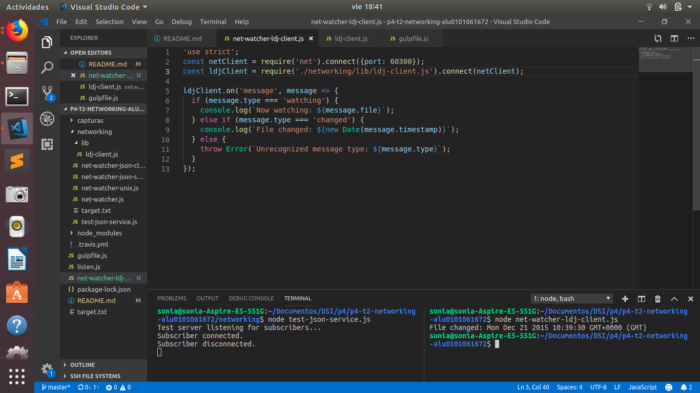

