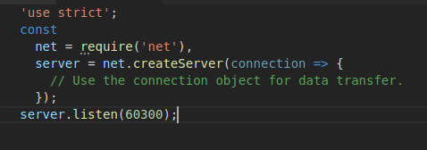

# Práctica 4: Networking with Sockets

#### Para la realización de la práctica voy a desarrollar un resumen o apuntes basados en lo aprendido y en lo considerado más importante. 

En esta práctica vamos a 

